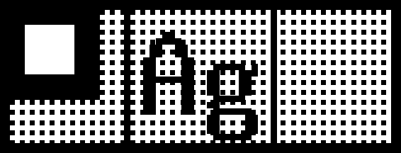

# sr5900p

A command-line interface for SR5900P tape printer.




```
make install

# preview.png will be generated after each commands:
sr5900p print --dry-run --width 36 --test-pattern
sr5900p print --dry-run --width 12 --test-pattern
sr5900p print --dry-run --width 12 --qr-text 'Hello, world!'
sr5900p print --dry-run --printer ${PRINTER_IP} --qr-text 'Hello, world!' # width auto detect

export PRINTER_IP=${YOUR_PRINTER_IP}
sr5900p print --printer ${PRINTER_IP} --test-pattern
sr5900p print --printer ${PRINTER_IP} --qr-text 'Hello, world!'
```

## License
MIT

## Author
hikalium

## Special Thanks
Mine02C4 (for [the initial analysis of the protocol](https://github.com/Mine02C4/TEPRA_PRO_SR5900P_analysis) )
